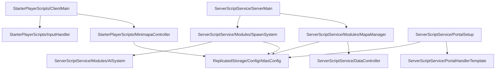

# ROBR — Estrutura de Diretórios e Scripts no Roblox Studio

Este documento serve como mapa de arquitetura e referência rápida do projeto **ROBR** (MMORPG no Roblox inspirado em Ragnarok Online com temática do folclore brasileiro). Ele detalha a localização exata de cada Script, ModuleScript, Folder e Remote no Roblox Studio para compartilhamento de contexto entre agentes de IA ou desenvolvedores.

---

## 🗺️ Mapa de Arquitetura (Resumo de Dependências)

---

## 📁 Estrutura Detalhada por Serviços

### 1. 🌍 Workspace (`game.Workspace`)
Gerencia o ambiente físico, geometria do mapa e entidades 3D ativas no servidor.

*   📂 **Shared/** — Configurações compartilhadas e partes físicas comuns.
*   📂 **Mapas/** — Pasta principal que abriga todas as regiões geográficas do jogo.
    *   📂 **Mapa1_YbiráPuera/** *(Rio das Árvores Antigas — Inicial — Nível 1–10)*
        *   📄 `Chao` *(Part — Baseplate verde de grama do bioma)*
        *   📂 **NPCs/** — NPCs posicionados no mapa.
            *   `NPC_Curandeiro Ancião` *(Part — Vende consumíveis básicos)*
            *   `NPC_Pajé do Rio` *(Part — NPC de quests)*
        *   📂 **Spawns/** — Pontos seguros para ressurgimento.
            *   `RespawnLocation` *(SpawnLocation — Ponto seguro na morte)*
        *   📂 **Zones/** — Regiões invisíveis que definem o spawn de monstros.
            *   `Zone_Margem do Rio` *(Part/Cylinder — Define área e raio de spawn)*
        *   *Modelos 3D de Mobs ativos (ex: "Sapo Cururu", "Capivara") criados dinamicamente.*
    *   📂 **Mapa2_FlorestaMaeDaMata/** *(Floresta de Mãe-da-Mata — Amazônia — Nível 10–15)*
        *   `Chao` | `NPCs` | `Spawns` | `Zones`
    *   📂 **Mapa3_TavyKatu/** *(Clareira Amaldiçoada — Cerrado Queimado — Nível 15–20)*
        *   `Chao` | `NPCs` | `Spawns` | `Zones`
    *   📂 **Mapa4_TupaMbara/** *(Campo dos Ancestrais — Cemitério — Nível 20–25)*
        *   `Chao` | `NPCs` | `Spawns` | `Zones`
    *   📂 **Mapa5_TemploNasNuvens/** *(Templo nas Nuvens — Montanha — Nível 25–30)*
        *   `Chao` | `NPCs` | `Spawns` | `Zones`
    *   📂 **Mapa6_YgaraMbya/** *(Caminho das Águas Escuras — Arena Boss — Nível 27–30)*
        *   `Chao` | `NPCs` | `Spawns` | `Zones`
        *   *Monstro ativo único: Boiúna (Boss MVP).*
*   🚩 `SpawnLocation` — Spawn central do lobby.
*   📄 `Baseplate` — Bloco padrão inicial do Studio.
*   🎥 `Camera` | `Terrain`

---

### 2. 📦 ReplicatedStorage (`game.ReplicatedStorage`)
Contêiner com dados compartilhados (Server e Client) e as portas de rede (RemoteEvents/RemoteFunctions).

*   📂 **Modules/**
    *   📂 **Config/** — Módulos que guardam os dados estáticos do jogo.
        *   📄 `MobsConfig` *(ModuleScript)* — Atributos base, HP, XP, elemento e taxas dos 16 mobs do MVP.
        *   📄 `ClassesConfig` *(ModuleScript)* — Configurações de atributos iniciais e árvores de habilidades das 3 classes (Tembira, Karaí, Payé).
        *   📄 `SkillsConfig` *(ModuleScript)* — Custos de mana, alcances e fórmulas de dano de cada habilidade.
        *   📄 `DropsConfig` *(ModuleScript)* — Tabela de loot dos mobs e taxas de cartas fixas em 0.5%.
        *   📄 `AtlasConfig` *(ModuleScript)* — Configurações de centros, tamanhos, chão, NPCs, portais e atmosfera de cada mapa.
        *   📄 `ItensConfig` *(ModuleScript)* — IDs e propriedades de consumíveis e equipamentos.
    *   📂 **Shared/** — Lógicas utilitárias e regras comuns.
        *   📄 `Formulas` *(ModuleScript)* — Fórmulas matemáticas de RPG (Evasão, Crítico, Velocidade de Ataque).
        *   📄 `DamageCalculator` *(ModuleScript)* — Cálculo centralizado de dano físico e mágico considerando elementos e defesa.
        *   📄 `Utils` *(ModuleScript)* — Funções auxiliares gerais.
        *   📄 `Constants` *(ModuleScript)* — Tabela de constantes globais (ex: limites de nível, taxas).
*   📂 **Remotes/** — Canais de comunicação de rede.
    *   📂 **Data/**
        *   📩 `RequestData` *(RemoteFunction)* — Recupera dados do save na entrada do jogador.
        *   📩 `UpdateStats` | `LevelUp` *(RemoteEvent)* — Atualização de atributos lógicos e nível.
    *   📂 **Combat/**
        *   📩 `Attack` | `UseSkill` | `DamageResult` *(RemoteEvent)* — Comandos e feedback de combate.
    *   📂 **Shop/**
        *   📩 `OpenShop` | `BuyItem` | `SellItem` *(RemoteEvent)* — Gerenciamento de compras/vendas com NPCs.
    *   📂 **Trade/**
        *   📩 `RequestTrade` | `AcceptTrade` | `CancelTrade` *(RemoteEvent)* — Negociação entre jogadores.
    *   📂 **Mapa/** *(Criado na Fase 3)*
        *   📩 `ChangeMap` *(RemoteEvent)* — Notifica o cliente de transições de mapas feitas via portal.
        *   📩 `LevelTooLow` *(RemoteEvent)* — Avisa o cliente quando o nível mínimo exigido pelo portal não foi atingido.
        *   📩 `UpdateMinimapa` *(RemoteEvent)* — Envia atualizações de posição dos mobs e jogadores (transmissão UDP rápida/unreliable).

---

### 3. 🛡️ ServerScriptService (`game.ServerScriptService`)
Lógica proprietária do servidor. Roda apenas no backend do Roblox e controla o estado e as regras de negócio de maneira segura.

*   📄 `ServerMain` *(Script)* — Ponto de partida. Roda o loop de atualização do IA dos monstros (Heartbeat) filtrando por mapa e a rede do minimapa com throttling (só envia atualizações se o jogador mover mais de 5 studs).
*   📄 `DataController` *(ModuleScript)* — Gerencia o carregamento e salvamento seguro de dados persistentes via `DataStoreService`.
*   📄 `CombatManager` *(ModuleScript)* — Valida o alcance do ataque básico, executa danos no servidor e gerencia estados de combate.
*   📄 `PartyManager` *(ModuleScript)* — Criação de equipes, distribuição de XP de grupo e buffs compartilhados.
*   📄 `ShopManager` *(ModuleScript)* — Valida e aplica a compra e venda de itens dos jogadores em lojas físicas de NPC.
*   📄 `TradeManager` *(ModuleScript)* — Lida com o ciclo de vida das trocas seguras de itens entre dois clientes conectados.
*   📄 `MobManager` *(ModuleScript)* — Funções genéricas de registro de vida e propriedades de mobs instanciados.
*   📄 `InventoryManager` *(ModuleScript)* — Organiza, equipa e remove itens do inventário lógico dos personagens.
*   📄 `PortalHandlerTemplate` *(Script — Desabilitado)* — Script genérico que é clonado dinamicamente para dentro de cada portal físico pelo setup.
*   📄 `PortalSetup` *(Script)* — Roda ao iniciar o servidor e gera os 10 portais físicos nas posições do `AtlasConfig` e insere o script neles.
*   📂 **Modules/** — Biblioteca interna do servidor.
    *   📄 `AISystem` *(ModuleScript)* — IA dos monstros (Comportamento de patrulha passiva, detecção de aggro ativo, fuga de mobs passivos e leashing/retorno ao ponto de spawn).
    *   📄 `SpawnSystem` *(ModuleScript)* — Controla o nascimento inicial e o timer de respawn programado de mobs ao morrerem (tempo herda do MobsConfig, padrão 30s).
    *   📄 `Party` *(ModuleScript)* — Classe auxiliar para guardar instâncias de grupos ativos.
    *   📄 `MapaManager` *(ModuleScript)* — Métodos de teletransporte com PivotTo, debounce do portal de 3s por jogador e detecção de mapa atual.

---

### 4. 👤 StarterPlayer (`game.StarterPlayer`)
Código e configurações executados localmente na máquina (Client-side) de cada jogador conectado.

*   📂 **StarterCharacterScripts/** *(Vazio — Customizações atreladas diretamente ao modelo do personagem)*
*   📂 **StarterPlayerScripts/**
    *   📄 `ClientMain` *(LocalScript)* — Ponto de partida do cliente. Captura o carregamento inicial do personagem e inputs principais (`F` para ataque básico, `E` para interagir e `Tab` para inventário).
    *   📄 `InputHandler` *(LocalScript)* — Gerenciador genérico de teclas locais e redirecionamento de comandos.
    *   📄 `CombatClient` *(LocalScript)* — Ouve o evento `DamageResult` e renderiza efeitos visuais locais (números flutuantes coloridos na cabeça do alvo e faíscas/sangue).
    *   📄 `UIController` *(LocalScript)* — Gerenciador de visibilidade e animação de painéis da HUD do cliente.
    *   📄 `ShopClient` *(LocalScript)* — Exibe e envia ações da tela de loja local.
    *   📄 `TradeClient` *(LocalScript)* — Interface do painel de negociações entre dois jogadores.
    *   📄 `MinimapaController` *(LocalScript — Criado na Fase 3)* — Controla o minimapa circular na tela (140x140px), desenha os pontos vermelhos relativos de mobs vivos e executa efeitos suaves de transição (iluminação ambiente, densidade de névoa e troca de música de fundo BGM) usando tweens na transição de regiões.
